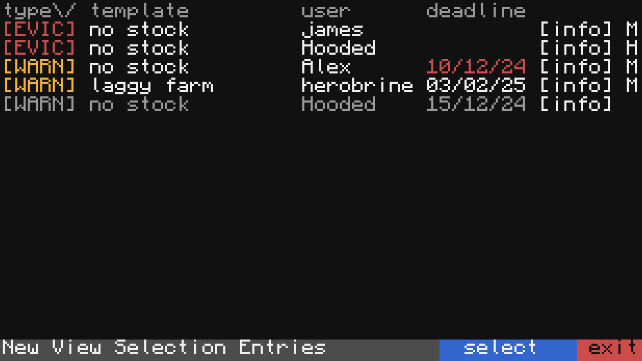

# KG infractions

Infraction manager for minecraft servers using [CC: tweaked](https://tweaked.cc/).



Uses templates in the `.sdoc` format, for more info see https://github.com/ShrekshelleraiserCC/shrekword/.

## Demo
A web demo has been implemented using [copy cat](https://github.com/SquidDev-CC/copy-cat)  
[![DemoIcon]][DemoLink]  


## Requirements
- CC: Tweaked
- `http` access for installer and connecting to discord webhook (optional)

## Installation
Install by running the following command in shell
```
wget run https://raw.githubusercontent.com/hooded-person/KGinfractions/refs/heads/main/setup/installer.lua
```

<!-- definitions -->
[DemoLink]: https://copy-cat.squiddev.cc/?startup=c2hlbGwucnVuKCd3Z2V0IHJ1biBodHRwczovL3Jhdy5naXRodWJ1c2VyY29udGVudC5jb20vaG9vZGVkLXBlcnNvbi9LR2luZnJhY3Rpb25zL3JlZnMvaGVhZHMvbWFpbi9zZXR1cC9pbnN0YWxsZXIubHVhJyk= 'Head to demo'  
[DemoIcon]: https://img.shields.io/badge/web_demo-black?style=for-the-badge&logoColor=yellow&logo=gnometerminal